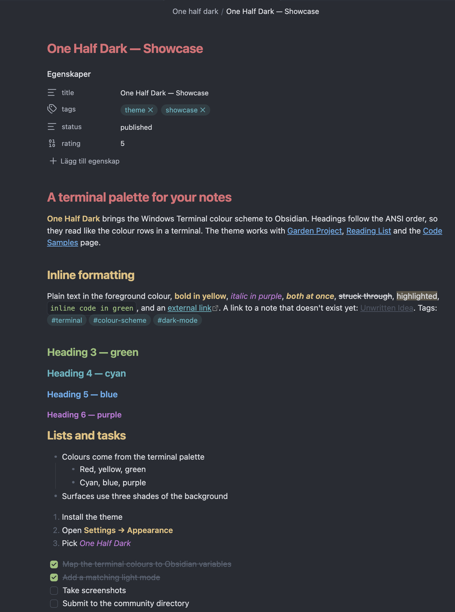
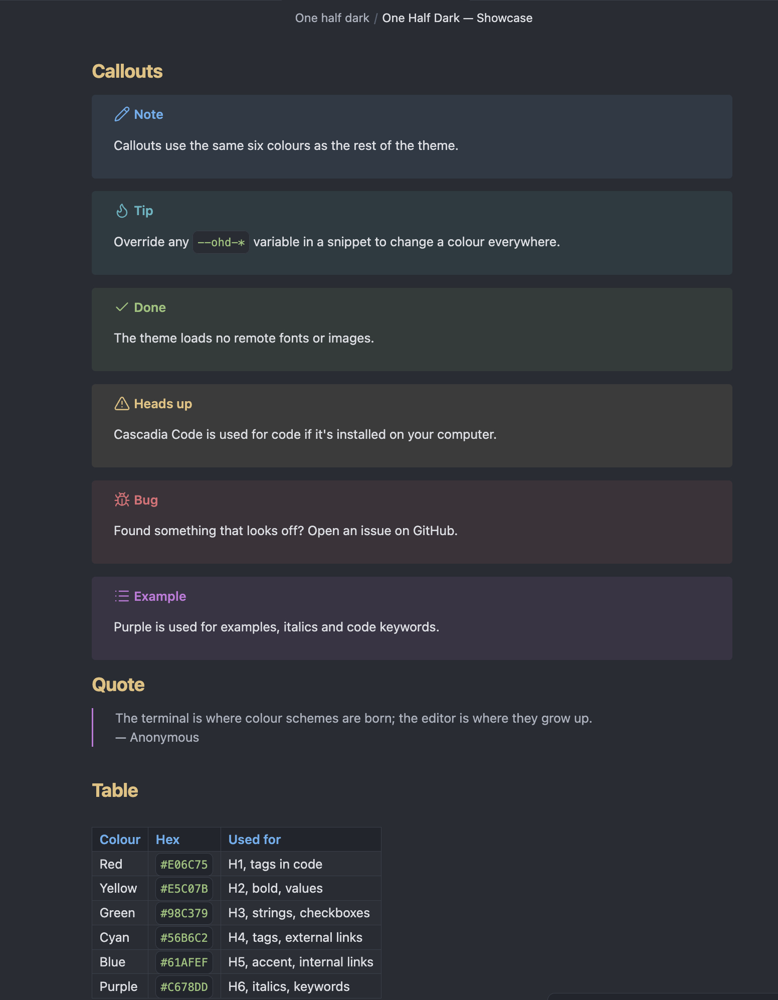
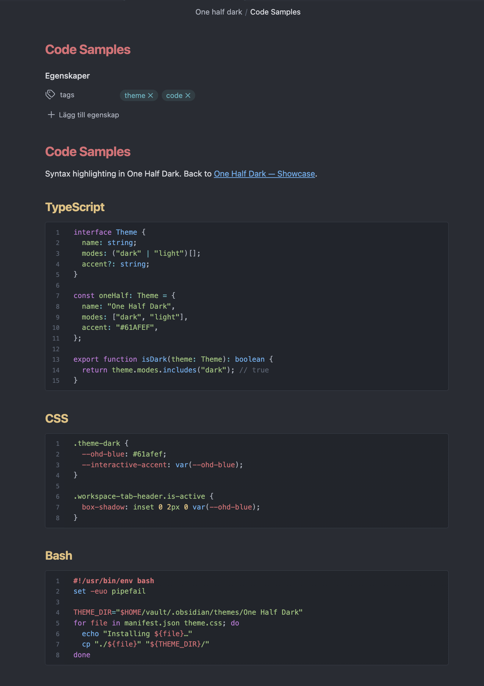
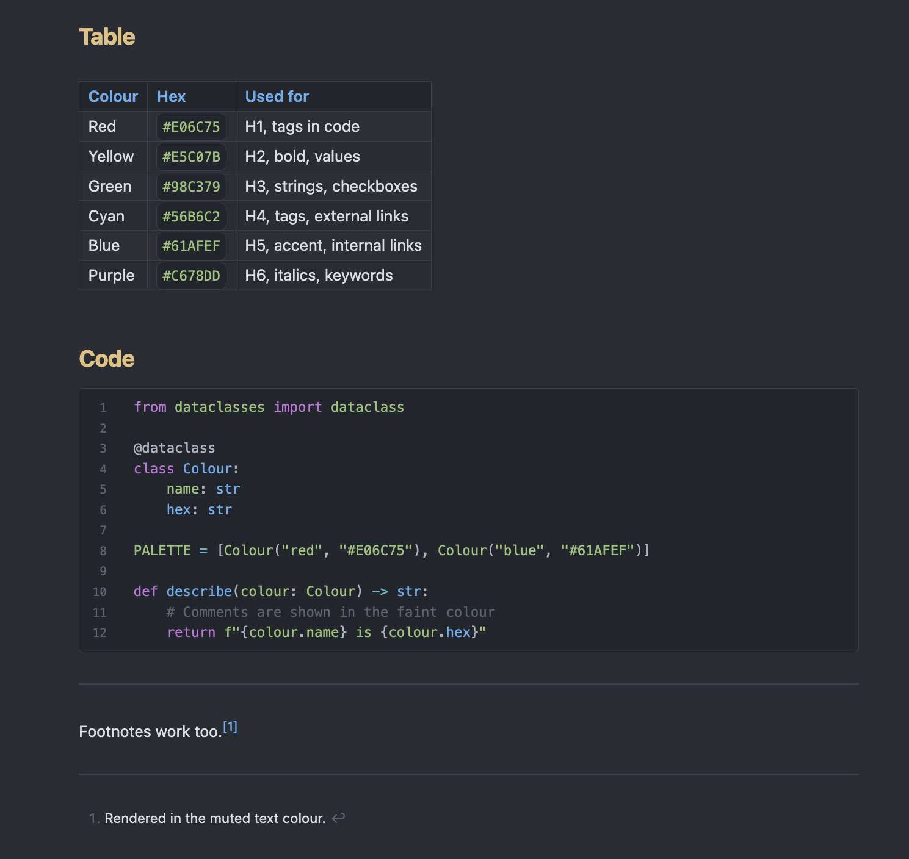
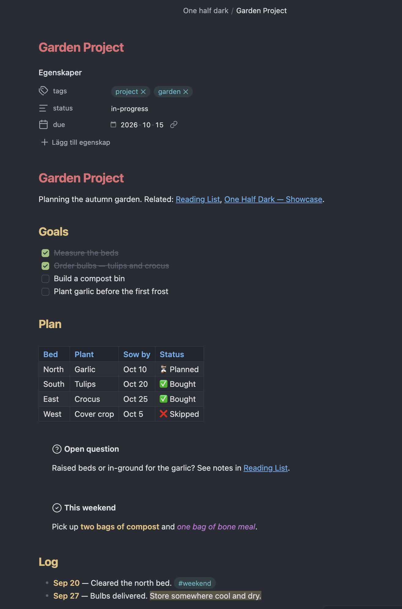

# One Half Dark

An Obsidian theme based on the **One Half Dark** colour scheme from Windows Terminal, with a matching **One Half Light** mode.



| Callouts                           | Code highlighting                          | Tables and code                                | Project note                                   |
| ---------------------------------- | ------------------------------------------ | ---------------------------------------------- | ---------------------------------------------- |
|  |  |  |  |

## Palette

| Role                 | Dark      | Light     |
| -------------------- | --------- | --------- |
| Background           | `#282C34` | `#FAFAFA` |
| Foreground           | `#DCDFE4` | `#383A42` |
| Faint (bright black) | `#5A6374` | `#A0A1A7` |
| Red                  | `#E06C75` | `#E45649` |
| Yellow               | `#E5C07B` | `#C18301` |
| Green                | `#98C379` | `#50A14F` |
| Cyan                 | `#56B6C2` | `#0997B3` |
| Blue (accent)        | `#61AFEF` | `#0184BC` |
| Purple               | `#C678DD` | `#A626A4` |

## Features

- Headings H1–H6 follow the ANSI order: red → yellow → green → cyan → blue → purple
- **Bold** in yellow and _italic_ in purple
- Code syntax highlighting follows the One Half colours
- Callouts, tables, tags, graph view and checklists use the same palette
- Blue accent line on the active tab, like Windows Terminal
- Monospace font order: Cascadia Code → JetBrains Mono → SF Mono → Menlo, using fonts already on your computer (no remote assets)
- Built only on Obsidian CSS variables with low-specificity selectors and no `!important`, so you can override anything with a snippet

## Installation

### From Obsidian (recommended)

1. Open **Settings → Appearance**.
2. Under **Themes**, select **Manage**.
3. Search for **One Half Dark** and select **Install and use**.

### Manual installation

1. Download `manifest.json` and `theme.css` from the [latest release](https://github.com/overjoyde/obsidian-one-half-dark/releases/latest).
2. In your vault, create the folder `.obsidian/themes/One Half Dark/` and put both files in it.
3. Restart Obsidian or reload the theme list, then pick **One Half Dark** under **Settings → Appearance → Themes**.

## Usage

- **Dark and light mode:** switch under **Settings → Appearance → Base colour scheme**. Dark uses One Half Dark and light uses One Half Light.
- **Code font:** install [Cascadia Code](https://github.com/microsoft/cascadia-code) to get the Windows Terminal font in code blocks. Without it, the theme falls back to JetBrains Mono, SF Mono or Menlo.

## Customising

The theme has no [Style Settings](https://github.com/mgmeyers/obsidian-style-settings) options. You customise it with a CSS snippet instead:

1. Open **Settings → Appearance → CSS snippets** and select the folder icon to open the snippets folder.
2. Create a file such as `one-half-tweaks.css` and add your overrides (examples below).
3. Back in Obsidian, reload the snippets and switch on `one-half-tweaks`.

Every colour is set once at the top of `theme.css` as an `--ohd-*` variable (`--ohd-red`, `--ohd-yellow`, `--ohd-green`, `--ohd-cyan`, `--ohd-blue`, `--ohd-purple`, `--ohd-bg`, `--ohd-fg` and so on), and everything else is built from them.

```css
/* Plain white bold text instead of yellow */
.theme-dark {
  --bold-color: var(--ohd-fg);
}

/* Use green as the accent colour */
.theme-dark {
  --accent-h: 95;
  --accent-s: 38%;
  --accent-l: 62%;
  --interactive-accent: var(--ohd-green);
  --link-color: var(--ohd-green);
}

/* All headings in one colour */
.theme-dark {
  --h1-color: var(--ohd-blue);
  --h2-color: var(--ohd-blue);
  --h3-color: var(--ohd-blue);
  --h4-color: var(--ohd-blue);
  --h5-color: var(--ohd-blue);
  --h6-color: var(--ohd-blue);
}
```

Use `.theme-light` instead of `.theme-dark` to change light mode.

## Credits

The palette comes from [One Half](https://github.com/sonph/onehalf) by Son A. Pham (MIT), as shipped in Windows Terminal.

## License

[MIT](./LICENSE)
